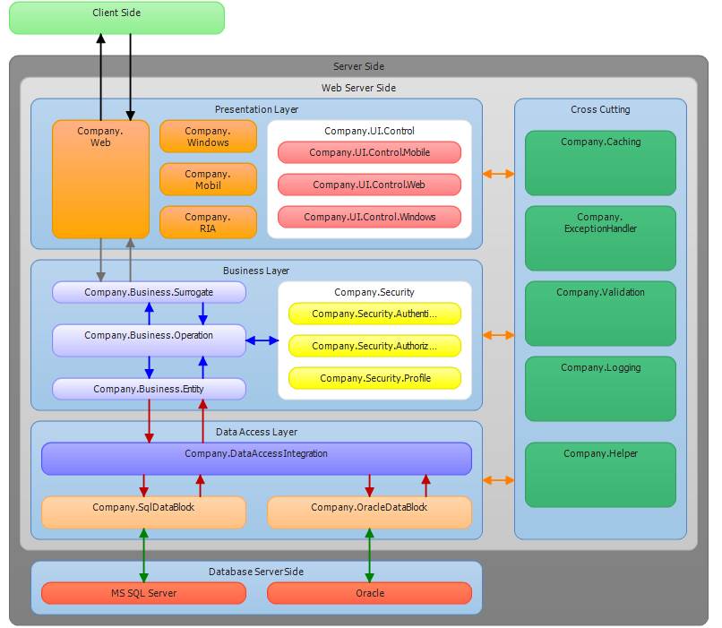
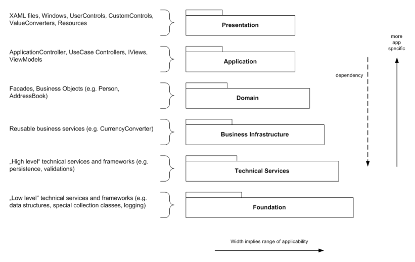
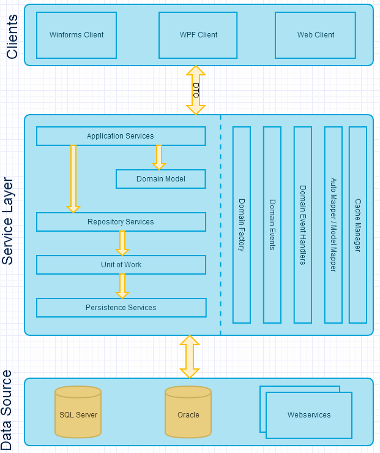
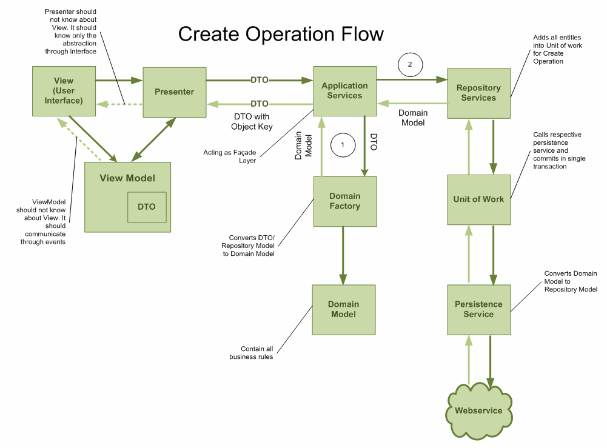

# 架构设计

1. [EmployeeManagement Demo Application](https://github.com/edmundhuang/EmployeeManagement)  
This repository contains a multi-layer application which was built for demonstration purposes. It contains a collection of patterns and services which are used in enterprise applications.  
* Layered architecture
* Dependency injection using AutoFac
* Test-driven design
* EntityFramework code-first database context
* UnitOfWork and repository pattern
* Restful WCF service with JSON
* Diverse client technologies. Using DTOs to exchange information with the backend and ViewModels (MVVM) to bind model data to views.  

Furthermore, the aim of this project was to show the interplay of the mentioned technologies, principles and practices.

Missing points

* Authentication and authorization
* Cross-platform mobile clients
* Localization
* Input validation
* Filtering, grouping, sorting, paging of list items

2. [Traditional N-tier Architecture Application](https://code.msdn.microsoft.com/windowsdesktop/Traditional-N-tier-80f841c2)  

3. [Northwind N-Tier Blueprint Application Using WPF/WCF/LINQ to SQL](https://www.codeproject.com/Articles/26826/Northwind-N-Tier-Blueprint-Application-Using-WPF-W)

4. [Layered Architecture]  
    * Presentation
    WPF views, user controls, custom controls, resources, styles, templates, etc. 
    * Application
    Controler,ViewModel, Interface, etc.
    * Domain
    * Business Infrastructure
    * Technical Services
    * Foundation

(https://github.com/jbe2277/waf/wiki/Layered-Architecture)

5. [Domain Driven Design (DDD) architecture layer design for CRUD operation](http://www.pinfaq.com/1478/domain-driven-design-architecture-layer-design-operation)

