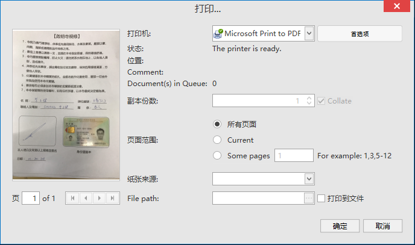

# 本地化

1. [How to localize DevExpress .NET controls](https://www.devexpress.com/Support/Center/Question/Details/A421/how-to-localize-devexpress-net-controls)

## DevExpress 本地化  
1、打印  
   
* `Current`  
Devexpress.XPF.Printing / LocalizationRes.resx  
PrintingStringId.CurrentPage  
Current | 当前页面 | 當前頁面 

* `The printer is ready.`  
Devexpress.Data  
Printing/LocalizationRes.resx  

* `Comment:`  
Devexpress.XtraPrinting   
lbPrinterCommentCaption.Text Comment: | 备注： | 備註：

