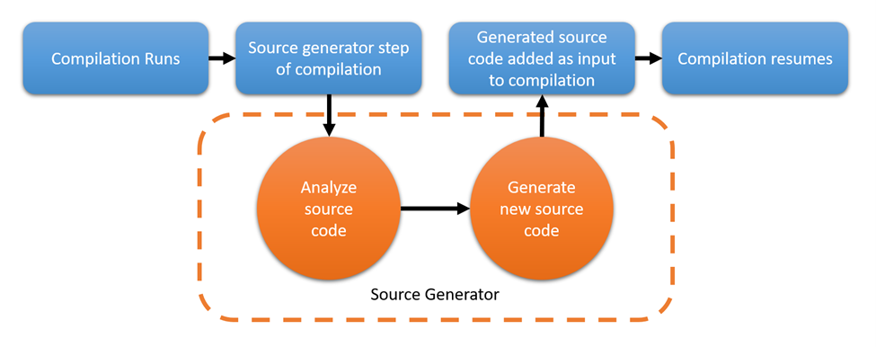

### Roslyn Generator

A Source Generator is a new kind of component that C# developers can write that lets you do two major things:

1. Retrieve a compilation object that represents all user code that is being compiled. This object can be inspected, and you can write code that works with the syntax and semantic models for the code being compiled, just like with analyzers today.

2. Generate C# source files that can be added to a compilation object during compilation. In other words, you can provide additional source code as input to a compilation while the code is being compiled.

### Reference
1. [Source Generators](https://docs.microsoft.com/en-us/dotnet/csharp/roslyn-sdk/source-generators-overview)
2. [Creating a source generator - Part 1](https://andrewlock.net/creating-a-source-generator-part-1-creating-an-incremental-source-generator/)