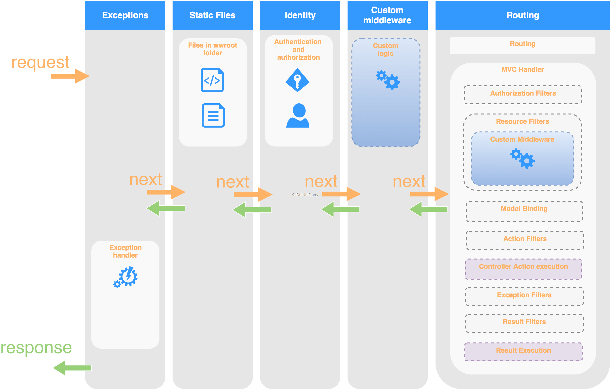

# Dotnet

1. [Authentication](./Auth/Readme.MD)

1. [Reflection Helper Utils for .NET](https://jonlabelle.com/snippets/view/csharp/reflection-helper-utils-for-net)  
Cross platform reflection helper utils for .NET framework used by Facebook C# SDK and SimpleJson.

2. [ASP.NET Core Web API Performance - Throughput for Upload and Download]http://weblogs.thinktecture.com/pawel/2017/03/aspnet-core-webapi-performance.html()