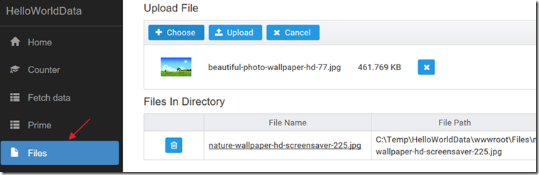
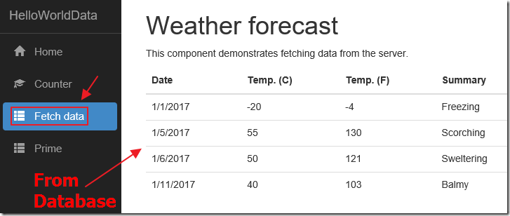

# ASP.NET Core 相关资源

1. [缓存](./Cache.md)
2. [Entity Framework Core](./EF.md)
3. [文件上传](./fileUpload.md)
4. [Authentication /Authorization](./Auth.md)
5. [Linq](./Linq.md)
6. [Json](./JSON.md)
7. [异常](./Exception.md)
8. [IOC](./IOC.md)
9. [CQRS](./cqrs.md)
10. [Swagger](./swagger.md)
11. [Identity Server](./ids4.md)
12. [Deploy](./deploy.md)
13. [SignalR](./signalR.md)

## 前端相关
1. [ASP.NET Core - Using JQuery DataTables](http://coderocks.co/2017/01/10/aspnetCore-Using-JQuery-DataTables/)
2. [Grid with Server Side Advanced Search using JQuery DataTables in ASP.NET MVC 5](https://www.codeproject.com/Articles/1170086/Implement-Grid-with-Server-Side-Advanced-Search-us)
3. 

## Authentication /Authorization

## Angular - PrimeNG
1. [Upgrading JavaScriptServices and PrimeNG From Angular 2 to Angular 4+](http://lightswitchhelpwebsite.com/Blog/tabid/61/EntryId/4306/Upgrading-JavaScriptServices-and-PrimeNG-From-Angular-2-to-Angular-4.aspx)

2. [Hello World Angular 2+ Data Sample Using JavaScriptServices .Net Core and PrimeNg](http://lightswitchhelpwebsite.com/Blog/tabid/61/EntryId/3304/Hello-World-Angular-2-Data-Sample-Using-JavaScriptServices-Net-Core-and-PrimeNg.aspx)

3. [CRUD Operation using ASP.NET CORE 2 and Angular 4 with EntityFramework Core, primeng Component and toastr-ng2](https://www.codeproject.com/Articles/1197953/CRUD-Operation-using-ASP-NET-CORE-and-Angular)

## Docker,CI,CD
1. [ASP.NET Core in docker with GitLab Pipelines](https://devblog.dymel.pl/2017/07/11/aspnetcore-docker-gitlab/#gitlab-pipelines)

## 文件上传下载
1. [Upload/Download Files in ASP.NET Core 2.0](https://www.codeproject.com/Articles/1203408/Upload-Download-Files-in-ASP-NET-Core)

2. [A .Net Core Angular 4 File Manager Using PrimeNG](http://lightswitchhelpwebsite.com/Blog/tabid/61/EntryId/4308/A-Net-Core-Angular-4-File-Manager-Using-PrimeNG.aspx)

3. [Web API File Uploading (Desktop and Web client)](https://chsakell.com/2015/06/07/web-api-file-uploading-desktop-and-web-client/)

4. [ASP.NET Core MVC file upload / download with MS SQL Server FileTable](https://github.com/damienbod/AspNetCoreFileUploadFileTable)
   [ASP.NET CORE 2.0 MVC FILE UPLOAD WITH MS SQL SERVER FILETABLE](https://damienbod.com/2015/12/05/asp-net-5-mvc-6-file-upload-with-ms-sql-server-filetable/)

5. [MSDN File upload](https://docs.microsoft.com/en-us/aspnet/core/mvc/models/file-uploads)
