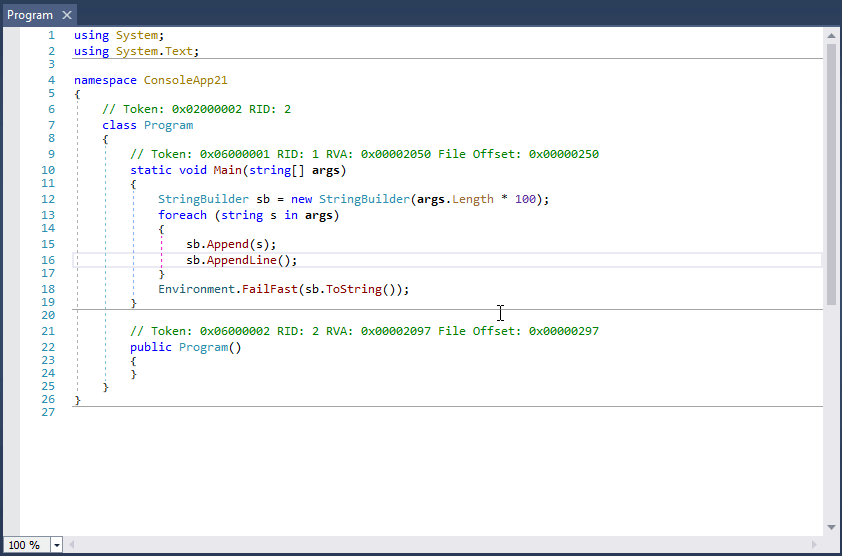

# 工欲善其事，必先利其器

在线工具
1. [Stackbiltz](https://stackblitz.com/) -- The online IDE for web applications. Powered by Visual Studio Code.

## Net 相关
1. [awesome-dotnet](https://github.com/quozd/awesome-dotnet)

2. [dnSpy](https://github.com/0xd4d/dnSpy) .NET debugger and assembly editor  
 dnSpy is a debugger and .NET assembly editor. You can use it to edit and debug assemblies even if you don't have any source code available.  
The following pictures show dnSpy in action. It shows dnSpy editing and debugging a .NET EXE file, not source code.  

## Visual Studio 
1. [Using Visual Studio Layer Diagrams for Fun and Profit!](http://geekswithblogs.net/Optikal/archive/2012/12/30/151680.aspx)
2. [Create layer diagrams from your code](https://msdn.microsoft.com/en-us/library/dd465141.aspx)
3. [Live architecture dependency validation in Visual Studio “15” Preview 5](https://blogs.msdn.microsoft.com/devops/2016/10/07/live-architecture-dependency-validation-in-visual-studio-15-preview-5/)

## Mock Data /Tools
1. [Mockaroo](https://www.mockaroo.com/)
1000行数据以下免费

2. 

## 网络
1. [SSH隧道翻墙的原理和实现](http://www.pchou.info/linux/2015/11/01/ssh-tunnel.html)

