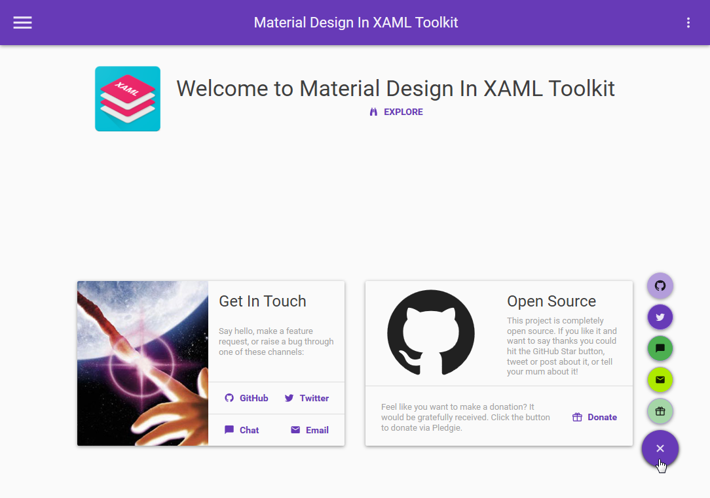
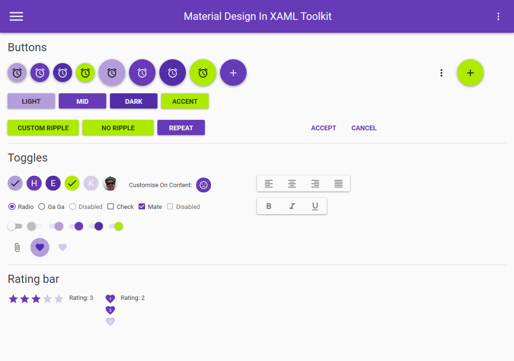
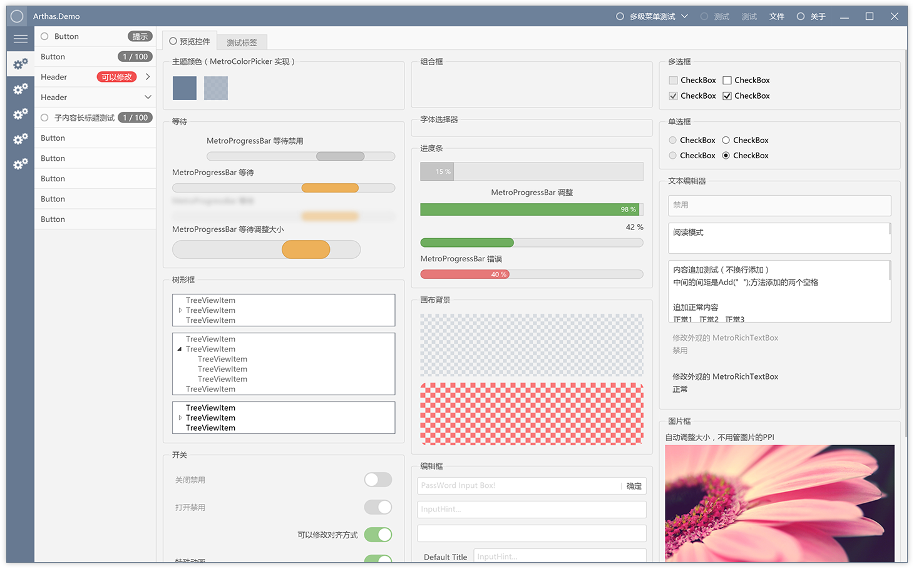

# WPF 相关资源

1. [Google's Material Design in XAML & WPF]
(https://github.com/ButchersBoy/MaterialDesignInXamlToolkit)

* Material Design styles for all major WPF Framework controls
* Additional controls to support the theme, including Multi Action Button, Cards, Dialogs, Clock
* Easy configuration of palette (at design and runtime), according to Google's guidelines
* Full Material Design Icons icon pack
* Easy transition effects
* Compatible with Dragablz, MahApps
* Demo applications included in the source project

2. [Arthas WPF UI 库](http://oneo.me/Arthas-WPF-UI-%E5%BA%93/)  
开源地址：[Github](https://github.com/1217950746/Arthas-WPFUI)

## Application Framework 
[Win Application Framework (WAF) is a lightweight Framework that helps you to create well structured XAML Applications.](https://github.com/jbe2277/waf)

## 知识点  
1. [WPF 需知](./common.md)
1. [数据绑定](./binding.md)

## UI 风格  
1. [Material Design](./materialDesign.md)
2. [mahapps.metro](,/mahMetro.md)

## Prism
1. [Prism: View Model Locator => Custom Convention to locate view models in separated assemblies](http://cyounes.com/2016/01/24/prism-custom-view-model-locator.html)

## 其他  
1. [Fody](./fody.md)

2. [ViewModel First WPF](https://edongashi.blog/2017/08/11/building-material-design-wpf-applications-an-introduction-to-viewmodel-first-routing/)

3. [Dynamic XAML: View Composer](https://gallery.technet.microsoft.com/Dynamic-XAML-View-Composer-8d9fa5d6)